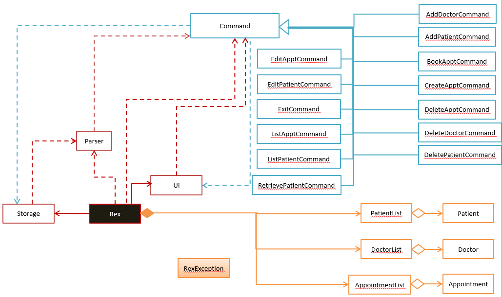
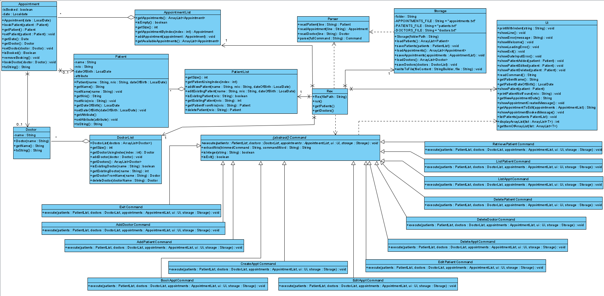
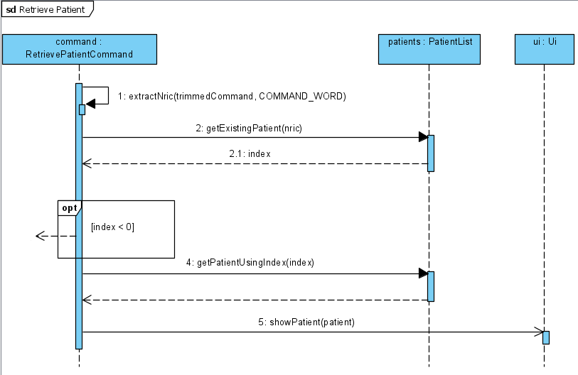
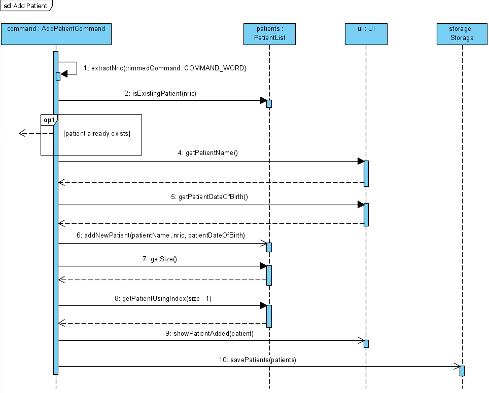

# Developer Guide

## Design & implementation

{Describe the design and implementation of the product. Use UML diagrams and short code snippets where applicable.}

The app was mainly inspired by [addressbook-level2](https://github.com/se-edu/addressbook-level2).

### Design
The App consists of a few main components.

* Ui: The UI that deals with getting user input and displaying output.
* Command: Command to be executed.
* Parser: Parse user input and make sense of it.
* Storage: Reads data from, and writes data to, the hard disk.
* Rex: The main class that initialize the app and starts running.

The rest are just objects that the app requires.

The diagram below shows the basic design.

The complete class diagram is shown below.

### Implementation
#### Retrieve Command
The flow for the retrieve command is as follows:

1. Retrieve command extracts NRIC using parser, 
2. Retrieve command searches through the patients list and obtains the patient's index.
3. Patients list returns the patient.
4. Ui object prints the patient.

#### Add Command
The flow for add command is as follows:

1. Add command extracts NRIC by calling its own method.
2. Add command checks patients list if NRIC already exists. Add command ends if so.
3. Add command calls Ui object to get the patient name and date of birth from user.
4. Patient list adds the new patient.
5. Add command obtains the newly added patient.
6. Ui receives the call to print the patient.
7. The updated patients list is saved by the Storage object.

#### Book Command
The flow for the book command is shown in the sequence diagram below:

## Product scope
### Target user profile

Administrative staff of hospitals who are overworked from having various responsibilities with repetitive tasks relating to doctors and patients.

### Value proposition

Aim: To facilitate the role of the administrative staff and help them automate most of the mundane tasks that they have to do. This enables the admin staff to have a one stop application to handle appointments and fees across different specialised clinics in the hospital. Administrative staff will have more time to help patients or do things that are more meaningful, such as answering queries from patients or doctors.

## User Stories

|Version| As a ... | I want to ... | So that I can ...|
|--------|----------|---------------|------------------|
|v1.0|admin|enter patient's details and store it|refer to them whenever I require them.|
|v1.0|admin|retrieve patient's details|use them to schedule appointments.|
|v1.0|admin|remove existing patient's details|remove unnecessary information.|
|v1.0|admin|view all appointments of a patient|remind patients of their appointments.|
|v1.0|admin|book an appointment for a patient|let them see the doctor.|
|v2.0|admin|add doctor|link doctor to appointment.|
|v2.0|admin|remove existing doctor's details|remove unnecessary information.|
|v2.0|admin|list patients|view patients.|
|v2.0|admin|edit appointments|update them.|

## Non-Functional Requirements

* The program must be easy for admins to use.
* The program must store patient's information.
* The program must store doctor's information.
* The program should run on any system running Java 11.

## Glossary

* *Hospitalsarus Rex* - The name of the program

## Instructions for manual testing

### Initial setup
1. Download the jar file and copy it into an empty directory
2. Open command prompt, and point it to that directory
3. Type in `java -jar Rex.jar` to run the file
### Deleting a patient
There must a patient in the list.
1. `delete 1` - Deletes the patient at the first index
2. `delete 0` - It should throw error and not delete a patient.
### Adding a patient
1. `add S9999999D` - Adds a patient with NRIC `S9999999D` to the list.
2. `add S9999999D` - It should not add a patient and throw error as patient already exists.
3. `add cat` - It should throw error and not add patients as it is invalid NRIC.